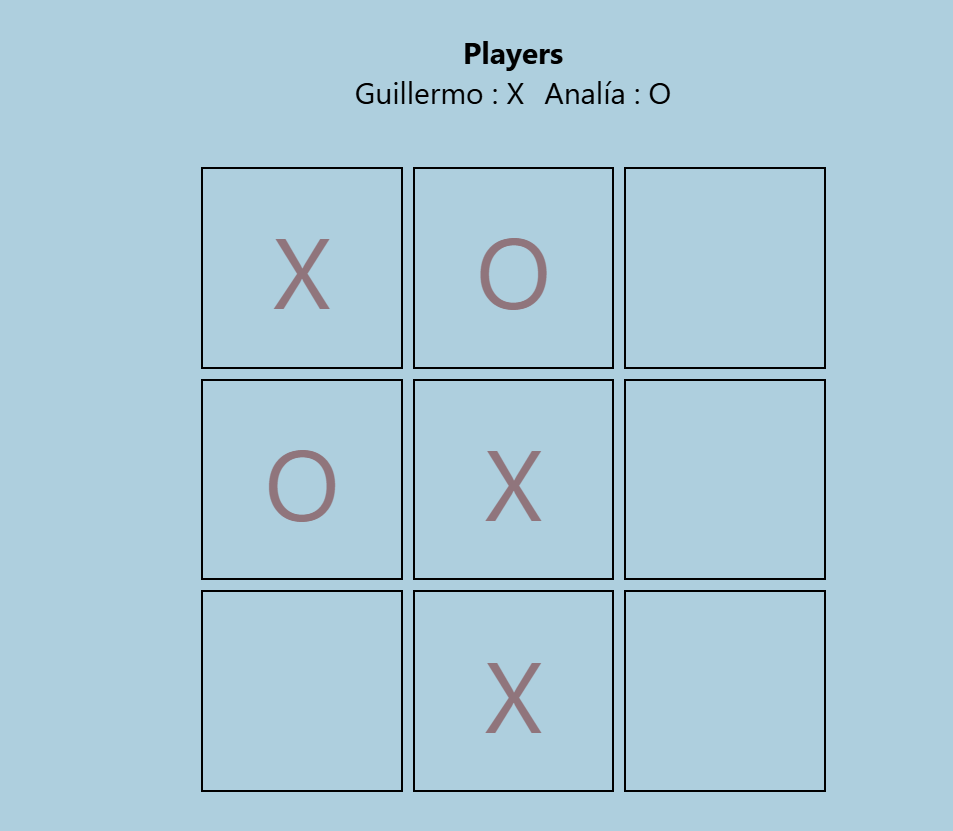

# ❌⭕ Tic-Tac-Toe Game

A classic and interactive Tic-Tac-Toe game built from scratch with HTML, CSS, and Vanilla JavaScript.  
This project focuses on DOM manipulation, core game logic, responsive design, and providing a smooth user experience.

---

## 🚀 Live Demo

👉 [Play the Game Here](https://gparej0.github.io/Tic-Tac-Toe/)

---

## 📸 Preview

 

---

## ✨ Features

- **Interactive Gameplay:** Play the classic Tic-Tac-Toe game seamlessly.
- **Two-Player Mode:** Local multiplayer functionality.
- **Dynamic Turn Switching:** Visual indicators for "X" and "O" turns.
- **Game State Detection:** Automatically detects and announces the winner or a draw.
- **Restart Functionality:** Reset the board instantly without reloading the page.
- **Fully Responsive:** Playable and visually appealing on both desktop and mobile devices.
- **Clean UI:** Modern, minimalist, and user-friendly interface.

---

## 🛠️ Technologies Used

- **HTML5:** Semantic game board structure.
- **CSS3:** Custom styling, Grid/Flexbox layouts, and interactive hover states.
- **JavaScript (Vanilla JS):** Game logic, state management, and DOM events.

---

## 📂 Project Structure

```text
📦 Tic-Tac-Toe
 ┣ 📂 assets
 ┃ ┗ 📜 (images and icons)
 ┣ 📜 index.html
 ┣ 📜 style.css
 ┣ 📜 script.js
 ┗ 📜 README.md
```
---

## 📚 What I Learned

Building this project was a great way to practice and solidify my JavaScript skills, specifically:

- **DOM Manipulation:** Selecting elements and updating the UI dynamically based on the game state.
- **Game Logic:** Using arrays and loops to check for winning combinations (rows, columns, diagonals).
- **Event Handling:** Managing click events on the game grid safely.
- **State Management:** Tracking current player turns and active game status.
- **Responsive Web Design:** Ensuring the game board scales perfectly on any screen size.

---

## ⚙️ Installation & Setup

1. **Clone the repository:**
   ```bash
   git clone https://github.com/GParej0/Tic-Tac-Toe.git
  

2. **Open the project folder:**
   ```bash
   cd Tic-Tac-Toe
   ```

3. **Run the game:**
   Simply open the `index.html` file in your favorite web browser to start playing!

---

## 🎯 Future Improvements

- [ ] Add a Single Player mode against an AI opponent (Minimax algorithm).
- [ ] Implement a score tracking system for multiple rounds.
- [ ] Add sound effects for clicks, wins, and draws.
- [ ] Include fun animations for the winning line.
- [ ] Add a Dark/Light mode toggle.

---

## 👨‍💻 Author

**Guillermo Parejo**
- GitHub: [@GParej0](https://github.com/GParej0)

---

⭐ *If you enjoyed playing this game or found the code helpful, please consider giving this repository a star!* ⭐
